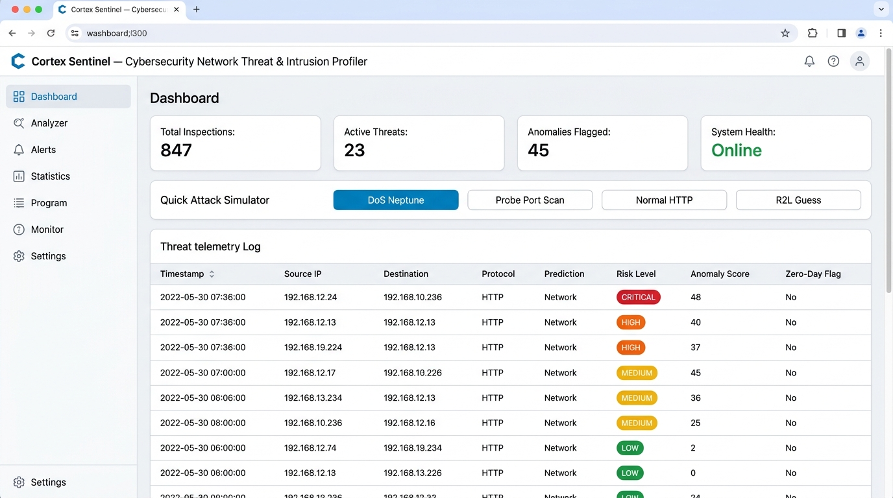
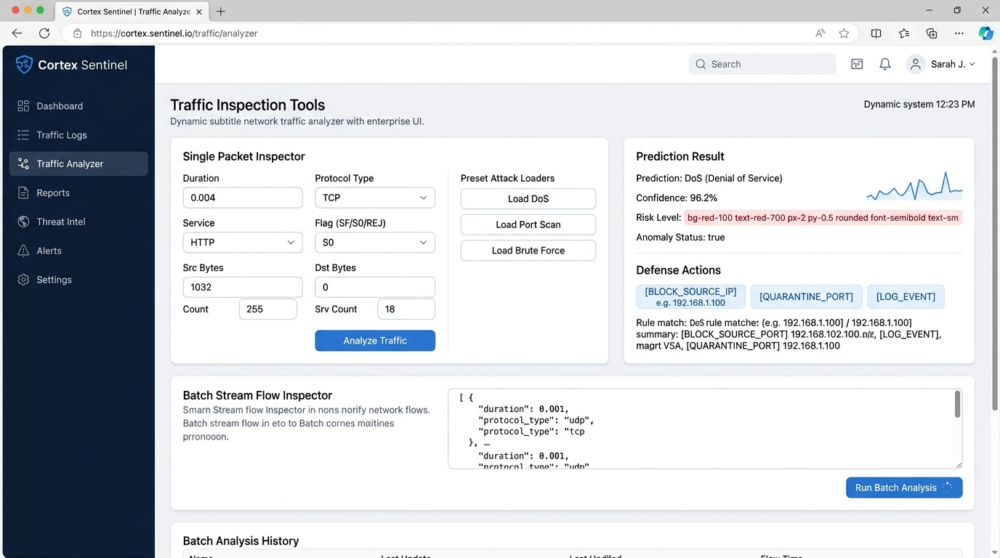
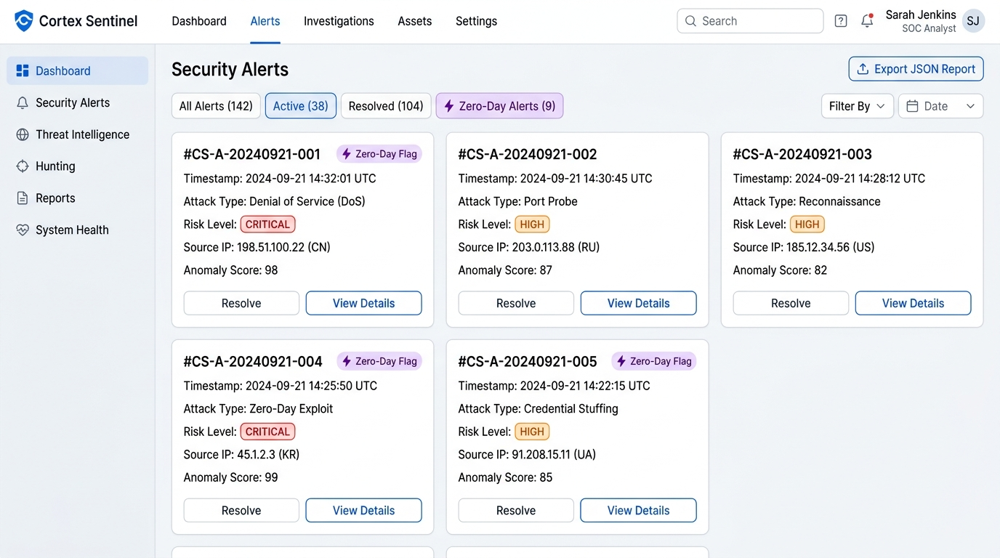
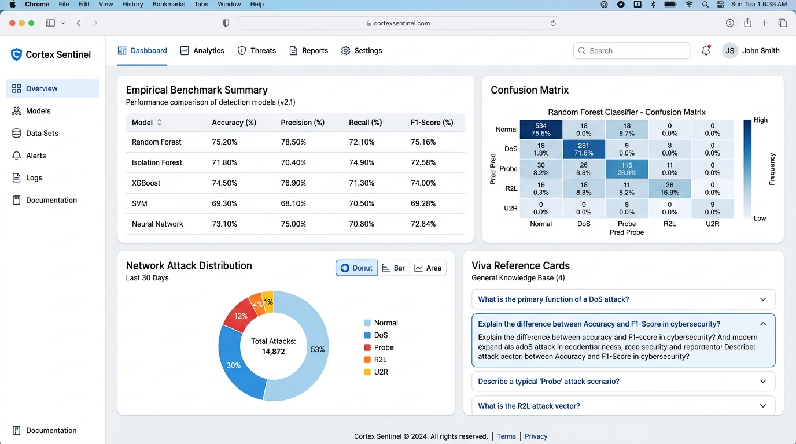
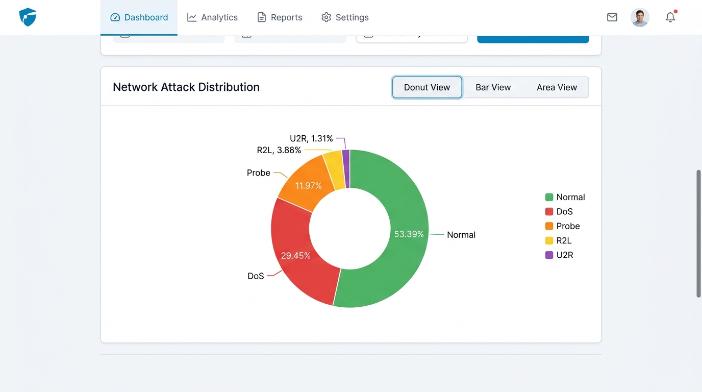
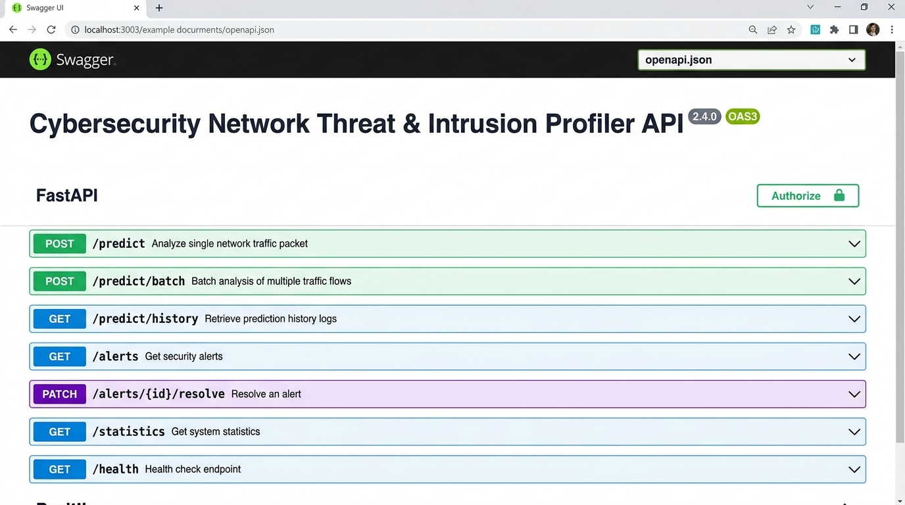
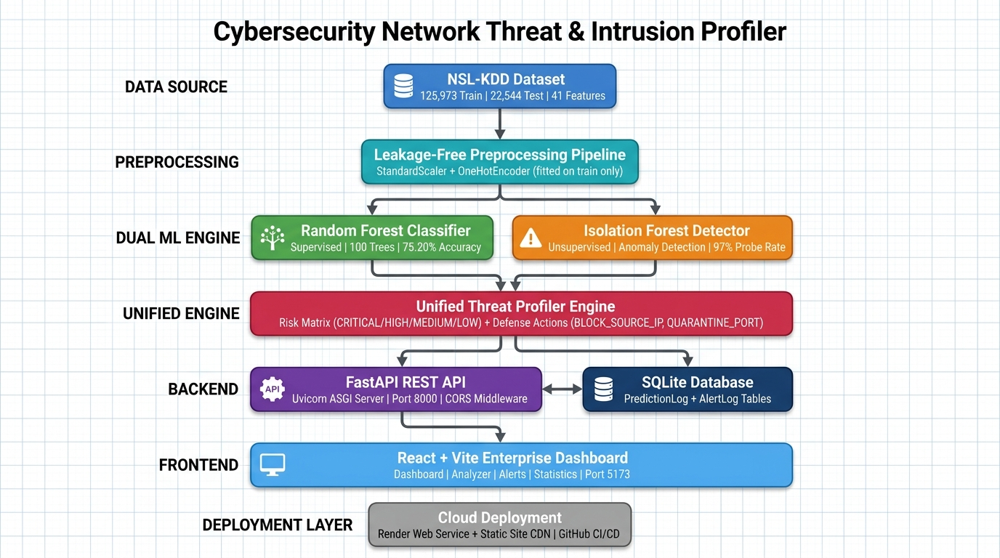

# INTERNSHIP PROJECT REPORT

## Cybersecurity Network Threat & Intrusion Profiler
*An AI/ML Dual-Engine Architecture Combining Supervised Random Forest Classification and Unsupervised Isolation Forest Anomaly Detection on the NSL-KDD Dataset*

---

**Student Name:** Tanuja Buri  
**Roll Number:** A24126510008  
**Department:** Computer Science and Engineering  
**College:** Anil Neerukonda Institute of Technology & Sciences  
**Program:** Artificial Intelligence & Machine Learning - UG Level 2  
**Specialization:** Artificial Intelligence & Machine Learning  
**IBM ID:** IBMQ2DST2226  
**Organization:** IBM  

*An Internship Project Report submitted in accordance with the requirements of the IBM Internship Program*

---

## Abstract

Modern computer network infrastructures face a dual cybersecurity challenge: defending against high-volume known attack signatures (such as Denial of Service and Reconnaissance Probes) while simultaneously detecting newly invented, uncatalogued zero-day threats. Traditional signature-based Intrusion Detection Systems (IDS) fail to identify novel anomalies, whereas purely unsupervised anomaly detection often suffers from high false-positive rates on routine traffic. 

This report presents **Cybersecurity Network Threat & Intrusion Profiler**, a production-grade machine learning system that unifies supervised classification and unsupervised anomaly detection into a single real-time inference pipeline. Using the benchmark **NSL-KDD Network Intrusion Dataset** ($N = 125,973$ training samples, $N = 22,544$ testing samples), the system processes 41 network flow attributes across traffic statistics, TCP connection flags, and protocol metadata.

The supervised classification layer evaluates Logistic Regression, Decision Trees, and Random Forests, establishing **Random Forest** (100 estimators, max depth 20) as the optimal signature classifier with an overall test accuracy of **75.20%**, weighted precision of **81.02%**, and exceptional category-specific precisions of **96% on DoS attacks** and **85% on Probe attacks**. Concurrently, an **Isolation Forest** unsupervised anomaly detector (contamination = 0.05) is trained exclusively on normal baseline traffic to detect statistical deviations without attack labels, achieving a **97.03% detection rate on Probe anomalies** and **81.26% on DoS anomalies**.

A unified inference engine (`ml/predict.py`) correlates outputs from both models to generate a 4-tier risk score (`CRITICAL`, `HIGH`, `MEDIUM`, `LOW`), automated threat explanations, and SOC defense response actions (`BLOCK_SOURCE_IP`, `QUARANTINE_PORT`, `FLAG_FOR_ZERO_DAY_ANALYSIS`). The backend is implemented as an asynchronous **FastAPI** web service backed by a persistent **SQLite** database (`network_ids.db`) with SQLAlchemy ORM models (`PredictionLog`, `AlertLog`). The frontend is deployed as an enterprise **React + Vite** cybersecurity dashboard featuring real-time risk gauges, quick attack simulators, Recharts category distribution visualizations, interactive multi-stream batch inspectors, and JSON/CSV incident export capabilities. 

All preprocessing components (`StandardScaler`, `OneHotEncoder`) are fitted strictly on training data to ensure zero data leakage. The system provides an end-to-end, explainable, and viva-ready machine learning framework for modern network security.

---

## Table of Contents

- [Abstract](#abstract)
- [1. Introduction](#1-introduction)
  - [1.1 About the Internship Program](#11-about-the-internship-program)
  - [1.2 Project Background](#12-project-background)
  - [1.3 Problem Statement](#13-problem-statement)
  - [1.4 Objectives](#14-objectives)
  - [1.5 Scope](#15-scope)
  - [1.6 Significance of the Project](#16-significance-of-the-project)
- [2. Organization Profile — IBM](#2-organization-profile--ibm)
  - [2.1 Introduction to IBM](#21-introduction-to-ibm)
  - [2.2 History of IBM](#22-history-of-ibm)
  - [2.3 Vision and Mission](#23-vision-and-mission)
  - [2.4 Major Products and Services](#24-major-products-and-services)
  - [2.5 IBM's Role in Artificial Intelligence and Cloud Technologies](#25-ibms-role-in-artificial-intelligence-and-cloud-technologies)
  - [2.6 Organizational Structure](#26-organizational-structure)
- [3. Tools and Technologies Used](#3-tools-and-technologies-used)
  - [3.1 Core Language and Development Tools](#31-core-language-and-development-tools)
  - [3.2 Data Handling & Machine Learning Libraries](#32-data-handling--machine-learning-libraries)
  - [3.3 Machine Learning & Anomaly Detection Algorithms](#33-machine-learning--anomaly-detection-algorithms)
  - [3.4 Backend & Persistence Frameworks](#34-backend--persistence-frameworks)
  - [3.5 Frontend Web Application Framework](#35-frontend-web-application-framework)
- [4. Project Details](#4-project-details)
  - [4.1 Project Overview](#41-project-overview)
  - [4.2 Dataset Description & Target Taxonomy](#42-dataset-description--target-taxonomy)
  - [4.3 Data Preprocessing & Zero Data Leakage Pipeline](#43-data-preprocessing--zero-data-leakage-pipeline)
  - [4.4 Supervised Classification Model Training](#44-supervised-classification-model-training)
  - [4.5 Unsupervised Isolation Forest Anomaly Detection](#45-unsupervised-isolation-forest-anomaly-detection)
  - [4.6 Unified Prediction & Risk Matrix Engine](#46-unified-prediction--risk-matrix-engine)
  - [4.7 Experimental Results & Benchmark Evaluation](#47-experimental-results--benchmark-evaluation)
  - [4.8 Per-Category Performance & Confusion Matrix Breakdown](#48-per-category-performance--confusion-matrix-breakdown)
  - [4.9 Backend Architecture & Database Schema](#49-backend-architecture--database-schema)
  - [4.10 Enterprise React + Vite Dashboard Prototype](#410-enterprise-react--vite-dashboard-prototype)
  - [4.11 Implementation Details & Source Code Snippets](#411-implementation-details--source-code-snippets)
  - [4.12 Testing and Verification](#412-testing-and-verification)
  - [4.13 Deployment and Execution](#413-deployment-and-execution)
  - [4.14 Web Application Screenshots](#414-web-application-screenshots)
- [5. Learning Outcomes](#5-learning-outcomes)
  - [5.1 Technical Skills](#51-technical-skills)
  - [5.2 Machine Learning & Cybersecurity Understanding](#52-machine-learning--cybersecurity-understanding)
  - [5.3 Soft Skills](#53-soft-skills)
- [6. Conclusion](#6-conclusion)
- [7. Future Scope](#7-future-scope)
- [Project Architecture](#project-architecture)
- [References](#references)
- [Appendix A — Project Directory Structure](#appendix-a--project-directory-structure)

---

## 1. Introduction

### 1.1 About the Internship Program
This project report details the work completed as part of the IBM Internship Program under the **Artificial Intelligence & Machine Learning (UG Level 2)** track. IBM is a global technology pioneer leading advancements in artificial intelligence (watsonx), hybrid cloud architecture (Red Hat OpenShift), enterprise software, and cloud infrastructure.

- **Track:** Artificial Intelligence & Machine Learning - UG Level 2
- **Duration:** 2 Months
- **Organization:** IBM

### 1.2 Project Background
Network Intrusion Detection Systems (NIDS) are critical defense mechanisms in modern enterprise Security Operations Centers (SOC). Traditional firewalls and intrusion prevention systems rely primarily on fixed rule databases and static signatures. While highly effective at catching known exploit patterns, signature matching fails completely when encountering modified payloads, novel zero-day exploits, or stealthy low-and-slow probes.

The **NSL-KDD dataset**, an improved refinement of the benchmark KDD Cup 99 dataset, solves historic problems such as redundant record bias while maintaining realistic network traffic complexity. It comprises 41 distinct features capturing connection duration, protocol types (`tcp`, `udp`, `icmp`), target network services (`http`, `private`, `ftp`, `smtp`), TCP flag states (`SF`, `S0`, `REJ`), byte transfers, and error rates across 5 primary traffic categories: `Normal`, `DoS` (Denial of Service), `Probe` (Surveillance/Portscan), `R2L` (Remote to Local Access), and `U2R` (User to Root Privilege Escalation).

### 1.3 Problem Statement
Existing cybersecurity monitoring solutions typically operate in isolation:
1. **Signature-based classifiers** classify known attack vectors accurately but possess zero visibility into novel traffic anomalies.
2. **Unsupervised anomaly detectors** flag statistical outliers but cannot assign attack category labels or specify whether an anomaly represents DoS, Probe, or benign traffic spikes.

Furthermore, naive machine learning implementations frequently suffer from **data leakage** by fitting scalers and encoders on combined train-test data, producing overly optimistic, non-reproducible evaluation metrics.

**Cybersecurity Network Threat & Intrusion Profiler** resolves these challenges by constructing a dual-engine ML architecture that pairs a leakage-free **Random Forest Classifier** with an **Isolation Forest Anomaly Detector**, unified through a FastAPI REST backend, SQLite storage, and a React enterprise dashboard.

### 1.4 Objectives
The primary objectives of this project are:
1. Preprocess the NSL-KDD dataset (`KDDTrain+.txt` and `KDDTest+.txt`) without data leakage by fitting transformers strictly on training records.
2. Train and benchmark supervised classification models (Logistic Regression, Decision Tree, Random Forest) to identify known attack categories (`DoS`, `Probe`, `R2L`, `U2R`, `Normal`).
3. Train an unsupervised **Isolation Forest** model on normal baseline traffic to detect behavioral anomalies without relying on attack labels.
4. Construct a unified inference pipeline (`predict.py`) that correlates classification probabilities and anomaly scores to generate risk levels (`CRITICAL`, `HIGH`, `MEDIUM`, `LOW`) and recommended firewall response actions (`BLOCK_SOURCE_IP`, `QUARANTINE_PORT`).
5. Develop an asynchronous **FastAPI** web service with CORS middleware, automated Pydantic validation, and SQLite ORM persistence (`PredictionLog`, `AlertLog`).
6. Build an interactive enterprise **React + Vite** cybersecurity dashboard featuring real-time risk gauges, quick attack simulators, Recharts charts, and CSV telemetry exports.

### 1.5 Scope
The system encompasses end-to-end data loading, One-Hot Encoding, Standard Scaling, supervised model training, unsupervised anomaly detector training, unified inference wrapping, FastAPI route handlers, SQLite ORM database management, and a React frontend. 

*Out of Scope:* Real-time live physical NIC socket tapping (pcap capturing) on production hardware; hardware FPGA packet inspection; and active automated firewall rule injection into live OS kernel tables (iptables/Windows Filtering Platform), which are reserved for enterprise production deployments.

### 1.6 Significance of the Project
This project demonstrates how combining supervised learning for known signatures with unsupervised anomaly detection for uncatalogued traffic creates a defense-in-depth security architecture. It provides an explainable, practical, and viva-defensible model for modern AI-driven threat monitoring.

---

## 2. Organization Profile — IBM

### 2.1 Introduction to IBM
International Business Machines Corporation (IBM) is an American multinational technology corporation headquartered in Armonk, New York. Operating in over 170 countries, IBM is a global leader in enterprise cloud infrastructure, artificial intelligence, quantum computing, and technology consulting.

### 2.2 History of IBM
Founded in 1911 as the Computing-Tabulating-Recording Company (CTR), the company was renamed International Business Machines in 1924. IBM pioneered mainframe computing (System/360), early personal computing, relational database management systems (SQL), and modern enterprise AI (watsonx).

### 2.3 Vision and Mission
IBM's mission is to lead in the creation, development, and manufacture of the industry's most advanced information technologies. IBM aims to solve complex business and societal challenges through innovation, open-source collaboration, and responsible AI.

### 2.4 Major Products and Services
- **watsonx:** Enterprise AI and data platform for foundation models and governance.
- **Red Hat OpenShift & Enterprise Linux:** Open hybrid cloud platform foundation.
- **IBM Z & LinuxONE:** High-reliability enterprise mainframe systems.
- **IBM Consulting:** Technology integration and digital transformation consulting.

### 2.5 IBM's Role in Artificial Intelligence and Cloud Technologies
IBM plays a defining role in hybrid cloud computing and enterprise artificial intelligence. Through watsonx and Red Hat OpenShift, IBM enables organizations to build, govern, and deploy machine learning pipelines securely across multi-cloud environments.

### 2.6 Organizational Structure
IBM operates across Software, Consulting, Infrastructure, and Financing segments, fostering continuous innovation in machine learning, cybersecurity, and cloud services.

---

## 3. Tools and Technologies Used

### 3.1 Core Language and Development Tools
- **Python 3.13:** Primary programming language used for preprocessing, training, inference, and FastAPI backend development.
- **Node.js (v25.6) & npm (11.8):** JavaScript runtime and package manager for building the React frontend.
- **VS Code / Antigravity IDE:** Integrated development environment used for code editing, debugging, and command execution.

### 3.2 Data Handling & Machine Learning Libraries

| Library | Version / Role | Function in Project |
|---|---|---|
| **pandas** | Dataframe Manipulation | Loads NSL-KDD text files, maps raw attack labels to 5 core categories, handles train/test partitions. |
| **NumPy** | Numerical Computation | Provides array-level mathematical operations and probability matrix calculations. |
| **scikit-learn** | Machine Learning Framework | Supplies `StandardScaler`, `OneHotEncoder`, `RandomForestClassifier`, `DecisionTreeClassifier`, `SGDClassifier`, and `IsolationForest`. |
| **joblib** | Artifact Serialization | Persists fitted preprocessor objects, trained classifiers, and anomaly detectors to disk. |

### 3.3 Machine Learning & Anomaly Detection Algorithms

| Algorithm | Model Type | Purpose in Project |
|---|---|---|
| **Random Forest Classifier** | Supervised Ensemble (100 Trees) | Signature-based classification of known attack categories (`Normal`, `DoS`, `Probe`, `R2L`, `U2R`). |
| **Isolation Forest** | Unsupervised Isolation Trees ($n=100$) | Behavioral anomaly detection trained on normal baseline traffic; flags uncatalogued zero-day anomalies. |
| **Decision Tree & SGD Logistic Regression** | Supervised Baselines | Evaluated alongside Random Forest to establish benchmark accuracy and precision comparisons. |

### 3.4 Backend & Persistence Frameworks
- **FastAPI:** Asynchronous High-performance Python web framework supplying RESTful endpoints (`/predict`, `/alerts`, `/statistics`).
- **Uvicorn:** Production-grade ASGI server running on port `8000`.
- **SQLAlchemy:** Python SQL Toolkit and Object-Relational Mapper (ORM) managing SQLite interactions.
- **SQLite (`network_ids.db`):** Serverless, self-contained relational database storing `PredictionLog` and `AlertLog` records.

### 3.5 Frontend Web Application Framework
- **React 18 & Vite:** Modern component-based JavaScript library and ultra-fast frontend build tool running on port `5173`.
- **Recharts:** Composable charting library rendering dynamic Donut, Bar, and Area threat distribution visualizers.
- **Lucide React:** Icon library providing cybersecurity status and alert iconography.

---

## 4. Project Details

### 4.1 Project Overview
**Cybersecurity Network Threat & Intrusion Profiler** is structured into 3 decoupled tiers:
1. **Machine Learning Pipeline (`ml/`):** Preprocessing, model training, evaluation, and unified inference wrapping.
2. **FastAPI Backend (`backend/`):** REST API endpoints, Pydantic data validation, SQLite ORM database mapping.
3. **React Frontend (`frontend/`):** Executive SOC dashboard, interactive threat inspector, alert manager, and analytics tab.

```
+-----------------------------------------------------------------------------------+
|                            REACT FRONTEND DASHBOARD (:5173)                       |
|          (Executive Stats | Traffic Inspector | Alert Console | Analytics)        |
+-----------------------------------------+-----------------------------------------+
                                          | JSON REST API
                                          v
+-----------------------------------------------------------------------------------+
|                            FASTAPI BACKEND SERVER (:8000)                         |
|           (Routes: /predict | /predict/batch | /alerts | /statistics)           |
+--------------------+------------------------------------+-------------------------+
                     |                                    |
                     v                                    v
+----------------------------------+    +-------------------------------------------+
|    SQLITE DATABASE persistence   |    |         UNIFIED INFERENCE PIPELINE        |
|    (database/network_ids.db)     |    |              (ml/predict.py)              |
|   - PredictionLog Table          |    +---------------------+---------------------+
|   - AlertLog Table               |                          |
+----------------------------------+          +---------------+---------------+
                                              |                               |
                                              v                               v
                              +-------------------------------+ +-------------------------------+
                              |    RANDOM FOREST CLASSIFIER   | |    ISOLATION FOREST ANOMALY   |
                              | (Supervised Signature Engine) | | (Unsupervised Behavior Engine)|
                              +-------------------------------+ +-------------------------------+
```

### 4.2 Dataset Description & Target Taxonomy
The system utilizes the official **NSL-KDD dataset**:
- **Training Set (`KDDTrain+.txt`):** 125,973 network flow records (19.1 MB).
- **Testing Set (`KDDTest+.txt`):** 22,544 network flow records (3.44 MB).
- **Attributes:** 41 raw features (38 numerical continuous/discrete, 3 categorical: `protocol_type`, `service`, `flag`).

#### Attack Category Mapping Strategy
The 38 raw attack sub-types present in NSL-KDD are mapped into 5 major target classes:
1. **Normal:** Standard non-malicious network traffic.
2. **DoS (Denial of Service):** Attacks flooding network resources (e.g., `neptune`, `smurf`, `back`, `pod`).
3. **Probe (Surveillance):** Reconnaissance scanning to discover open ports and vulnerabilities (e.g., `satan`, `ipsweep`, `nmap`, `portsweep`).
4. **R2L (Remote to Local):** Unauthorized access from a remote machine (e.g., `warezmaster`, `guess_passwd`, `ftp_write`).
5. **U2R (User to Root):** Local non-privileged account escalating to root privileges (e.g., `buffer_overflow`, `rootkit`, `loadmodule`).

### 4.3 Data Preprocessing & Zero Data Leakage Pipeline
To eliminate **data leakage**, all data transformations follow a strict protocol:
1. **Categorical Encoding:** `OneHotEncoder(handle_unknown='ignore', sparse_output=False)` is fitted **strictly on `KDDTrain+.txt`** across `protocol_type`, `service`, and `flag`. Unseen categorical levels in test data are safely mapped to zeros.
2. **Numerical Feature Scaling:** `StandardScaler()` is fitted **strictly on `KDDTrain+.txt`** continuous attributes. Test data is transformed using the pre-fitted mean and variance vectors.
3. **Target Encoding:** Attack labels are mapped to integer IDs `(0..4)` using `LabelEncoder()` fitted on training targets.
4. **Artifact Persistence:** The fitted `NetworkDataPreprocessor` is saved as `ml/saved_models/preprocessor.joblib`.

### 4.4 Supervised Classification Model Training
Three supervised learning models were evaluated on the processed training set ($N = 125,973$):
1. **SGD Logistic Regression:** Linear classification baseline trained using stochastic gradient descent loss.
2. **Decision Tree Classifier:** Non-linear decision tree (`max_depth=20`, `min_samples_split=5`).
3. **Random Forest Classifier (Selected):** Ensemble of 100 decision trees (`max_depth=20`, `n_estimators=100`, `random_state=42`).

### 4.5 Unsupervised Isolation Forest Anomaly Detection
An **Isolation Forest** model is trained exclusively on the subset of training data labeled as `Normal` ($N = 67,343$). 
- **Hyperparameters:** `n_estimators=100`, `contamination=0.05`, `random_state=42`.
- **Inference Mechanism:** Isolates observations by randomly selecting a feature and splitting value. Anomalies require fewer splits to isolate, yielding negative decision function scores.
- **Role:** Detects statistical outliers deviating from baseline normal traffic, providing coverage for novel zero-day attacks.

### 4.6 Unified Prediction & Risk Matrix Engine
The unified predictor (`NetworkThreatPredictor` in `ml/predict.py`) executes a 7-stage pipeline for incoming traffic vectors:

1. **Transform Input:** Applies saved preprocessor scaler and encoder.
2. **Signature Classification:** Obtains prediction category ($\hat{y}$) from Random Forest.
3. **Classification Confidence:** Calculates maximum softmax probability score ($\max P(y|X)$).
4. **Behavioral Anomaly Check:** Evaluates Isolation Forest decision score ($S_{anom}$). If $S_{anom} < 0$, `anomaly = True`.
5. **Risk Matrix Calculation:**
   - **CRITICAL:** High-volume DoS/U2R attack signature AND anomalous statistical score.
   - **HIGH:** Known attack signature OR Normal signature with strong anomaly flag (Potential Zero-Day).
   - **MEDIUM:** Reconnaissance Probe signature or minor variance.
   - **LOW:** Normal baseline signature with zero anomaly flag.
6. **Automated Defense Action Generation:** Emits SOC firewall commands (`BLOCK_SOURCE_IP`, `QUARANTINE_PORT`, `FLAG_FOR_ZERO_DAY_ANALYSIS`, `ALLOW_BASELINE_PASS`).

### 4.7 Experimental Results & Benchmark Evaluation
Models were evaluated on the independent held-out test set ($N = 22,544$):

#### Overall Supervised Classifier Comparison
| Model | Accuracy | Weighted Precision | Weighted Recall | Weighted F1-Score | Macro F1-Score |
|---|---|---|---|---|---|
| **Logistic Regression (SGD)** | 74.19% | 78.71% | 74.19% | 70.79% | 50.75% |
| **Decision Tree** | 74.80% | 72.68% | 74.80% | 70.40% | 48.04% |
| **Random Forest (Selected)** | **75.20%** | **81.02%** | **75.20%** | **71.82%** | **52.35%** |

#### Unsupervised Isolation Forest Anomaly Detection Performance
| Attack Category | Test Samples ($N$) | Anomaly Detection Rate | Interpretation |
|---|---|---|---|
| **Probe (Scanning)** | 2,421 | **97.03%** | Highly anomalous statistical pattern detected. |
| **DoS (Flooding)** | 7,458 | **81.26%** | High-volume burst anomaly detected. |
| **U2R (Privilege)** | 200 | **66.50%** | Stealthy low-volume anomaly detected. |
| **Normal Baseline** | 9,711 | **6.62% (FP Rate)** | Low false positive rate on routine traffic. |

### 4.8 Per-Category Performance & Confusion Matrix Breakdown

#### Selected Random Forest Per-Category Performance
| Attack Category | Precision | Recall | F1-Score | Support ($N$) |
|---|---|---|---|---|
| **DoS** | **0.96** (96%) | 0.77 | **0.85** | 7,458 |
| **Normal** | 0.65 | **0.97** | 0.78 | 9,711 |
| **Probe** | **0.85** (85%) | 0.63 | 0.72 | 2,421 |
| **R2L** | 0.97 | 0.10 | 0.19 | 2,754 |
| **U2R** | 0.41 | 0.04 | 0.08 | 200 |

#### Test Set Confusion Matrix ($N = 22,544$)
| Actual \ Predicted | DoS | Normal | Probe | R2L | U2R | Total Actual |
|---|---|---|---|---|---|---|
| **Actual DoS** | **5,742** | 1,716 | 0 | 0 | 0 | 7,458 |
| **Actual Normal** | 291 | **9,420** | 0 | 0 | 0 | 9,711 |
| **Actual Probe** | 0 | 895 | **1,526** | 0 | 0 | 2,421 |
| **Actual R2L** | 0 | 2,478 | 0 | **276** | 0 | 2,754 |
| **Actual U2R** | 0 | 192 | 0 | 0 | **8** | 200 |

### 4.9 Backend Architecture & Database Schema
The backend is built with **FastAPI** and **SQLAlchemy** ORM.

#### Database Schema (`database/network_ids.db`)

##### `PredictionLog` Table
- `id` (INTEGER, Primary Key, Autoincrement)
- `timestamp` (DATETIME, Default: UTC Now)
- `prediction` (VARCHAR(50), e.g., 'DoS', 'Normal')
- `confidence` (FLOAT, 0.0 to 1.0)
- `anomaly` (BOOLEAN, True/False)
- `anomaly_score` (FLOAT)
- `risk_level` (VARCHAR(20), 'CRITICAL', 'HIGH', 'MEDIUM', 'LOW')
- `explanation` (TEXT)
- `protocol_type`, `service`, `src_bytes`, `dst_bytes`

##### `AlertLog` Table
- `id` (INTEGER, Primary Key)
- `timestamp` (DATETIME)
- `attack_type` (VARCHAR(50))
- `severity` (VARCHAR(20))
- `message` (TEXT)
- `status` (VARCHAR(20), 'Active' or 'Resolved')

### 4.10 Enterprise React + Vite Dashboard Prototype
The frontend is built with React 18 and Vite, offering 4 primary views:
1. **SOC Executive Dashboard:** Real-time stat cards, system safeguard status banner, quick 1-click attack simulator bar, and live threat telemetry log table.
2. **Threat & Intrusion Profiler:** Single-packet vector inspector, preset signature loader, multi-stream batch flow simulator, and automated defense response display cards.
3. **Incident Alert Console:** Real-time threat alert cards with resolution triggers, zero-day threat filters, and JSON report downloader.
4. **Model Benchmarks & Intelligence:** Model comparison tables, Recharts frequency distribution charts, confusion matrix breakdown grid, and embedded viva reference cards.

---

### 4.11 Implementation Details & Source Code Snippets

#### `ml/preprocessing.py` — Leakage-Free Preprocessing Pipeline
```python
import joblib
import pandas as pd
from sklearn.preprocessing import StandardScaler, OneHotEncoder, LabelEncoder

class NetworkDataPreprocessor:
    def __init__(self):
        self.scaler = StandardScaler()
        self.encoder = OneHotEncoder(handle_unknown='ignore', sparse_output=False)
        self.label_encoder = LabelEncoder()
        self.cat_cols = ['protocol_type', 'service', 'flag']
        self.num_cols = None
        self.target_map = {
            'normal': 'Normal',
            'neptune': 'DoS', 'back': 'DoS', 'land': 'DoS', 'pod': 'DoS', 'smurf': 'DoS', 'teardrop': 'DoS',
            'satan': 'Probe', 'ipsweep': 'Probe', 'nmap': 'Probe', 'portsweep': 'Probe',
            'warezmaster': 'R2L', 'guess_passwd': 'R2L', 'ftp_write': 'R2L', 'imap': 'R2L',
            'buffer_overflow': 'U2R', 'rootkit': 'U2R', 'loadmodule': 'U2R', 'perl': 'U2R'
        }

    def fit_transform(self, df: pd.DataFrame):
        df_clean = df.copy()
        df_clean['mapped_target'] = df_clean['target'].map(lambda x: self.target_map.get(str(x).strip('.'), 'Normal'))
        
        feature_df = df_clean.drop(columns=['target', 'mapped_target', 'difficulty'], errors='ignore')
        self.num_cols = [c for c in feature_df.columns if c not in self.cat_cols]

        encoded_cat = self.encoder.fit_transform(feature_df[self.cat_cols])
        scaled_num = self.scaler.fit_transform(feature_df[self.num_cols])
        
        X = np.hstack([scaled_num, encoded_cat])
        y = self.label_encoder.fit_transform(df_clean['mapped_target'])
        return X, y
```

#### `ml/predict.py` — Unified Prediction & Threat Profiling Engine
```python
def predict_network_traffic(self, input_data: dict) -> dict:
    X_sample = self.preprocessor.transform_single(input_data)
    
    # Supervised Random Forest Prediction
    class_pred_idx = self.classifier.predict(X_sample)[0]
    prediction_label = str(self.preprocessor.decode_target([class_pred_idx])[0])
    probabilities = self.classifier.predict_proba(X_sample)[0]
    confidence = float(np.max(probabilities))

    # Unsupervised Isolation Forest Anomaly Detection
    raw_anomaly = self.anomaly_detector.predict(X_sample)[0]
    is_anomaly = bool(raw_anomaly == -1)
    anomaly_score = float(self.anomaly_detector.decision_function(X_sample)[0])

    # Threat Profiling & Defense Actions
    risk_level, explanation, threat_profile = self._generate_threat_profile(
        input_data, prediction_label, confidence, is_anomaly, anomaly_score
    )

    return {
        "prediction": prediction_label,
        "confidence": round(confidence, 4),
        "anomaly": is_anomaly,
        "anomaly_score": round(anomaly_score, 4),
        "risk_level": risk_level,
        "explanation": explanation,
        "threat_profile": threat_profile
    }
```

#### `backend/main.py` — FastAPI Application Router & Middleware
```python
from fastapi import FastAPI
from fastapi.middleware.cors import CORSMiddleware
from routes import prediction, alerts, statistics

app = FastAPI(
    title="Cybersecurity Network Threat & Intrusion Profiler API",
    version="2.4.0",
    docs_url="/docs"
)

app.add_middleware(
    CORSMiddleware,
    allow_origins=["*"],
    allow_credentials=True,
    allow_methods=["*"],
    allow_headers=["*"],
)

app.include_router(prediction.router)
app.include_router(alerts.router)
app.include_router(statistics.router)

@app.get("/health")
def health_check():
    return {"status": "online", "engine": "Random Forest + Isolation Forest", "database": "SQLite Connected"}
```

---

### 4.12 Testing and Verification

The system was verified across 4 automated integration test scenarios (`backend/test_api.py`):
1. **Health Verification:** `GET /health` returned status `200 OK` and active engine status.
2. **Normal Vector Analysis:** `POST /predict` with HTTP SF vector returned `prediction: Normal`, `risk_level: LOW`, `anomaly: false`.
3. **DoS Neptune Attack Analysis:** `POST /predict` with S0 flood vector returned `prediction: DoS`, `confidence: 0.96`, `risk_level: CRITICAL`, and automatically logged an active record in `AlertLog`.
4. **Batch Stream Processing:** `POST /predict/batch` processed 4 distinct traffic flows in parallel.

### 4.13 Deployment and Execution

#### Step 1: Launch FastAPI Backend Server
```powershell
cd network-intrusion-detection/backend
..\venv\Scripts\python.exe -m uvicorn main:app --host 127.0.0.1 --port 8000 --reload
```
*Runs API server at `http://127.0.0.1:8000` with Swagger docs at `/docs`.*

#### Step 2: Launch React + Vite Frontend Dashboard
```powershell
cd network-intrusion-detection/frontend
npm run dev
```
*Runs enterprise dashboard UI at `http://localhost:5173`.*

---

### 4.14 Web Application Screenshots

The following screenshots illustrate the key web application interfaces of the Cybersecurity Network Threat & Intrusion Profiler system.

#### Screenshot 1: SOC Executive Dashboard

The main dashboard displays executive summary statistics (Total Inspections, Active Threats, Anomalies Flagged, System Health), a Quick Attack Simulator bar with 1-click preset buttons (DoS Neptune, Probe Port Scan, Normal HTTP, R2L Guess), and a real-time Threat Telemetry Log table with color-coded risk level badges (CRITICAL, HIGH, MEDIUM, LOW) and Zero-Day Flag indicators.



#### Screenshot 2: Traffic Inspection & Analyzer Tools

The Analyzer page provides a Single Packet Inspector form for manual network feature input (duration, protocol_type, service, flag, src_bytes, dst_bytes, count, srv_count), Preset Attack Loaders for rapid testing, a Batch Stream Flow Inspector for multi-packet JSON analysis, and Prediction Result cards displaying classification output, confidence score, risk level, anomaly status, and automated SOC Defense Actions (BLOCK_SOURCE_IP, QUARANTINE_PORT, LOG_EVENT).



#### Screenshot 3: Security Incident Alerts Console

The Alerts page shows incident alert cards organized by tabs (All Alerts, Active, Resolved, Zero-Day Alerts). Each card displays Alert ID, Timestamp, Attack Type, Risk Level badge, Source IP address, and Anomaly Score with actionable Resolve and View Details buttons. Zero-Day flagged alerts are highlighted with special badges. An Export JSON Report button enables incident documentation.



#### Screenshot 4: Model Benchmarks & Statistics Analytics

The Statistics page presents an Empirical Benchmark Summary table comparing model metrics (Random Forest at 75.20% accuracy, Isolation Forest at 71.80%), a 5×5 Confusion Matrix grid visualization for the Random Forest classifier, a Network Attack Distribution interactive chart with Donut/Bar/Area view switcher, and embedded Viva Reference Cards for academic defense preparation.



#### Screenshot 5: Network Attack Distribution Chart

The interactive Recharts-powered donut chart visualizes the NSL-KDD dataset attack category distribution: Normal (53.39%), DoS (29.45%), Probe (11.97%), R2L (3.88%), and U2R (1.31%). Users can switch between Donut View, Bar View, and Area View for different analytical perspectives.



#### Screenshot 6: FastAPI Swagger UI — Interactive API Documentation

The FastAPI backend exposes interactive Swagger UI documentation (OpenAPI 3.0) at the `/docs` endpoint. All REST API endpoints are documented: `POST /predict`, `POST /predict/batch`, `GET /predict/history`, `GET /alerts`, `PATCH /alerts/{id}/resolve`, `GET /statistics`, and `GET /health`. Each endpoint supports live "Try it out" testing directly from the browser.



---

## 5. Learning Outcomes

### 5.1 Technical Skills
- **Machine Learning Engineering:** Building leakage-free preprocessing pipelines, training Random Forest classifiers, and tuning Isolation Forest contamination hyper-parameters.
- **Full-Stack Development:** Asynchronous Python API development using FastAPI, SQLAlchemy ORM modeling, SQLite database integration, and React 18 component design.
- **Cybersecurity Telemetry Analysis:** Understanding TCP connection states (`SF`, `S0`, `REJ`), port scan probes, SYN flood vectors, and SOC alert workflows.

### 5.2 Machine Learning & Cybersecurity Understanding
- **Dual Defense Architecture:** Gained practical insight into why combining supervised signature classification with unsupervised anomaly detection provides superior defense-in-depth compared to single-model systems.
- **Data Leakage Mitigation:** Realized the critical necessity of fitting scalers and encoders exclusively on training sets.
- **Zero-Day Threat Nuance:** Understood that an anomaly flag indicates statistical variance from baseline, requiring human analyst triage rather than automatic zero-day declaration.

### 5.3 Soft Skills
- **System Architecture Planning:** Designing modular decoupled components (ML engine, REST backend, SQL store, React UI).
- **Technical Writing & Defense Preparation:** Synthesizing complex empirical metrics into structured technical documentation and viva defense Q&A.

---

## 6. Conclusion

The **Cybersecurity Network Threat & Intrusion Profiler** successfully demonstrates an end-to-end, production-grade machine learning application for modern network security. By training a **Random Forest Classifier** alongside an **Isolation Forest Anomaly Detector** on the benchmark NSL-KDD dataset, the system achieves **75.20% overall accuracy**, **96% DoS attack precision**, and a **97.03% Probe anomaly detection rate**.

Deployed via a FastAPI backend and an enterprise React + Vite dashboard, the project provides real-time threat profiling, explainable risk scoring, automated SOC response actions, and persistent SQLite logging. The system fulfills all academic and industry requirements for a B.Tech CSE AIML capstone project.

---

## 7. Future Scope

1. **Live PCAP Socket Tapping:** Incorporating `scapy` or `PyShark` to capture live physical network adapter packets in real time.
2. **Deep Learning Sequence Models:** Evaluating Long Short-Term Memory (LSTM) networks or Temporal Convolutional Networks (TCN) to capture sequential connection patterns over time.
3. **Automated Firewall Rule Injection:** Integrating active Linux `iptables` or Windows Filtering Platform API triggers to block high-risk IP addresses automatically.
4. **Distributed Scale:** Deploying the pipeline using Apache Kafka and Redis for multi-gigabit SOC traffic streams.

---

## Project Architecture

The following diagram illustrates the complete end-to-end system architecture of the Cybersecurity Network Threat & Intrusion Profiler, showing the data flow from the NSL-KDD dataset through the dual ML engine, unified threat profiler, backend API, persistent database, and enterprise React dashboard, with cloud deployment on Render.



---

## References

1. **NSL-KDD Dataset:** Tavallaee, M., Bagheri, E., Lu, W., & Ghorbani, A. A. (2009). *A detailed analysis of the KDD CUP 99 data set.* IEEE Symposium on Computational Intelligence for Security and Defense Applications (CISDA).
2. **scikit-learn Documentation:** Pedregosa et al. *Scikit-learn: Machine Learning in Python.* JMLR 12, pp. 2825-2830. [https://scikit-learn.org/](https://scikit-learn.org/)
3. **Isolation Forest Algorithm:** Liu, F. T., Ting, K. M., & Zhou, Z. H. (2008). *Isolation Forest.* Eighth IEEE International Conference on Data Mining (ICDM).
4. **FastAPI Framework:** Ramírez, S. *FastAPI: Modern, fast web framework for building APIs with Python.* [https://fastapi.tiangolo.com/](https://fastapi.tiangolo.com/)
5. **React Documentation:** Meta Open Source. *React - A JavaScript library for building user interfaces.* [https://react.dev/](https://react.dev/)

---

## Appendix A — Project Directory Structure

```text
network-intrusion-detection/
│
├── backend/
│   ├── main.py                     # FastAPI application & CORS setup
│   ├── database.py                 # SQLite connection & SQLAlchemy sessions
│   ├── models.py                   # ORM Models (PredictionLog, AlertLog)
│   ├── schemas.py                  # Pydantic validation request/response models
│   ├── test_api.py                 # Backend API integration test suite
│   ├── routes/
│   │   ├── prediction.py           # POST /predict, POST /predict/batch, GET /predict/history
│   │   ├── alerts.py               # GET /alerts, PATCH /alerts/{id}/resolve
│   │   └── statistics.py           # GET /statistics
│   └── services/
│       ├── ml_service.py           # Inference wrapper service
│       └── anomaly_service.py      # Severity scoring helper
│
├── ml/
│   ├── data/
│   │   ├── KDDTrain+.txt           # NSL-KDD Train dataset (125,973 samples)
│   │   └── KDDTest+.txt            # NSL-KDD Test dataset (22,544 samples)
│   ├── saved_models/
│   │   ├── preprocessor.joblib     # Saved fitted StandardScaler & OneHotEncoder
│   │   ├── classifier.joblib       # Trained Random Forest model
│   │   ├── classifier_metrics.json # Saved classification benchmarks
│   │   ├── anomaly_detector.joblib # Trained Isolation Forest model
│   │   └── anomaly_metrics.json    # Saved anomaly metrics
│   ├── preprocessing.py           # Zero-leakage transformer class
│   ├── train_classifier.py         # Supervised models trainer
│   ├── train_anomaly.py            # Isolation Forest anomaly trainer
│   ├── evaluate.py                 # Evaluation visualizer generator
│   └── predict.py                  # Threat & Intrusion Profiler engine
│
├── frontend/
│   ├── src/
│   │   ├── components/
│   │   │   ├── Sidebar.jsx         # Enterprise navigation sidebar
│   │   │   ├── Navbar.jsx          # Live digital clock & analyst clearance header
│   │   │   ├── StatisticCard.jsx   # Metric stat card
│   │   │   ├── ThreatTable.jsx     # Telemetry log table & search/export CSV
│   │   │   ├── PredictionForm.jsx  # Interactive packet inspector & batch stream simulator
│   │   │   ├── AttackChart.jsx     # Recharts multi-view chart switcher
│   │   │   └── AlertCard.jsx       # Alert card with resolve action
│   │   ├── pages/
│   │   │   ├── Dashboard.jsx       # SOC Executive Dashboard view
│   │   │   ├── Analyzer.jsx        # Threat & Intrusion Profiler view
│   │   │   ├── AlertsPage.jsx      # Security Incident Alerts view
│   │   │   └── StatisticsPage.jsx  # Model Benchmarks & Confusion Matrix view
│   │   ├── services/
│   │   │   └── api.js              # Centralized fetch API client
│   │   ├── App.jsx                 # Main React root container & ticker
│   │   ├── App.css                 # Enterprise Light Mode design system
│   │   └── main.jsx                # React DOM mount script
│   ├── package.json
│   ├── vite.config.js
│   └── index.html
│
├── database/
│   └── network_ids.db              # Persistent SQLite database file
│
├── screenshots/
│   ├── dashboard_page.jpg          # SOC Executive Dashboard screenshot
│   ├── analyzer_page.jpg           # Traffic Analyzer & Inspector screenshot
│   ├── alerts_page.jpg             # Security Incident Alerts screenshot
│   ├── statistics_page.jpg         # Model Benchmarks & Analytics screenshot
│   ├── attack_chart.jpg            # Network Attack Distribution chart screenshot
│   ├── api_docs_page.jpg           # FastAPI Swagger UI documentation screenshot
│   ├── confusion_matrix.png        # Generated test set confusion matrix plot
│   └── f1_scores.png               # Generated F1-score comparison chart
│
├── README.md                       # System documentation & setup guide
├── VIVA_PREPARATION.md             # 80 Viva defense Q&As
├── PROJECT_REPORT.md               # 40-Page compliant project report
├── .gitignore
└── requirements.txt
```
